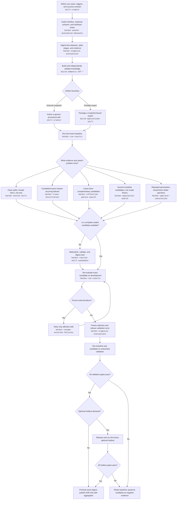

# Evidence-Driven Knowledge Skill Creation and Evolution

This playbook defines how to create, evaluate, evolve, and promote the strongest
knowledge skills that the available evidence supports. It covers both parts of
the result:

1. the quality of the immutable knowledge and its retrieval projections; and
2. the quality of the skill that retrieves, verifies, synthesizes, and cites
   that knowledge.

The process is designed for Semantic OKF expert skills, but its Harbor
evaluation rules also apply to other knowledge-bound skills.

## Core rule

There is no universally best builder, retriever, or evolution strategy.
"Best" means best on a frozen use case, dataset, cohort, candidate budget,
identity grouping, runtime, and metric contract while passing every mandatory
gate. A strategy that wins on another dataset is a prior to test, not a result
to copy.

Never change the knowledge builder and the consultation behavior in the same
treatment. Improve one layer while the other is digest-frozen; otherwise, the
cause of a score change cannot be identified.

The current release invariant is `discovery` (optional), optimizer-visible
`development`, sealed one-way `validation`, and an optional later sealed
`holdout`. Select exactly one candidate using development evidence, freeze and
digest-bind it, and only then release validation once. A failed validation or
any feedback-driven revision ends the study and requires fresh validation in a
new study. Holdout, when declared, is a third final gate and never a source of
same-study mutation feedback.

## The skill stack

Use the following skills in the stated roles. Skills marked **required** form
the default promotion-capable path. Conditional skills are used only when their
trigger applies.

| Order | Skill | When to use it | Output |
| ---: | --- | --- | --- |
| 1 | `skill-creator` | **Required** when creating a new skill or changing its public trigger, structure, instructions, references, scripts, or assets | A valid, progressively disclosed skill package |
| 2 | `harbor-author-evaluation-datasets` | **Required** when creating or revising task families, split candidates, hardware strata, or adapter response surfaces | A reviewed private authoring plan with family-safe partitions and replayable nuisance variants |
| 3 | `harbor-organize-evaluations` | **Required** before a study that may influence selection or promotion | Digest-locked dataset manifests, disjoint splits, ordered stages, evidence bindings, and controlled validation/holdout release |
| 4 | Matched `build-semantic-okf-*` skill | **Required** for Semantic OKF knowledge construction | A deterministic, independently validated, immutable knowledge snapshot |
| 5 | `build-specialized-skill` | **Required** for a standalone snapshot-bound expert; omit it when a generic consultant will read an external snapshot | A portable expert skill with embedded knowledge, reviewed guidance, query helper, and digest-bound manifest |
| 6 | `harbor-run-results` | **Required** for baseline execution, result validation, comparison, and reporting | Native Harbor jobs and comparable case-level evidence |
| 7 | One primary evolution controller | **Required only when improving a baseline**; choose from the strategy matrix below | One or more proposed or evaluated mutations |
| 8 | `harbor-realize-skill-candidate` | Use when an evolution controller emits a mutation contract rather than a complete sealed bundle | A validated, digest-sealed candidate derived from the frozen parent |
| 9 | `harbor-run-results` | **Required** after realization unless the primary controller already owns that exact evaluation | Fresh development evidence for the exact candidate digest |
| 10 | `harbor-resume-external-failures` | Use only for proven provider or infrastructure failures | Append-only retries without laundering semantic failures |
| 11 | `harbor-organize-evaluations` | **Required** to freeze selection and release untouched validation once | A one-way, auditable transition from development to validation |
| 12 | The owning evolution skill or `harbor-run-results` | **Required** for baseline-versus-candidate validation and any declared optional holdout | Final qualification evidence |
| 13 | `harbor-metaskill-evolution` | Optional after several comparable development generations | An analysis-only meta-policy frontier; never a promotion decision |

The primary evolution controllers are:

- `harbor-evolve-skill`
- `harbor-trace-distillation`
- `harbor-reflective-pareto-search`
- `harbor-population-search`
- `harbor-operator-coevolution`

Select one controller for each development stage. Controllers may be chained
across explicitly separated stages—for example, trace distillation can propose
a candidate population that a later Pareto stage explores—but only one
controller should own selection inside a stage.

## End-to-end process



The validation boundary, followed by optional holdout, is one-way:

```mermaid
stateDiagram-v2
    state "Selection frozen" as SelectionFrozen
    state "Validation released" as ValidationReleased
    state "Validation passed" as ValidationPassed
    state "Holdout released" as HoldoutReleased
    state "Baseline retained" as BaselineRetained
    [*] --> Discovery
    Discovery --> Development: freeze task and metric contract
    Development --> SelectionFrozen: select only from development; bind digests
    SelectionFrozen --> ValidationReleased: release validation once
    ValidationReleased --> ValidationPassed: all validation gates pass
    ValidationReleased --> BaselineRetained: any validation gate fails
    ValidationPassed --> Promoted: no holdout declared
    ValidationPassed --> HoldoutReleased: release optional holdout once
    HoldoutReleased --> Promoted: all gates pass with no forbidden regression
    HoldoutReleased --> BaselineRetained: any gate fails
    Promoted --> [*]
    BaselineRetained --> [*]
```



After validation or holdout is released, do not return to development with
knowledge learned from it. A new mutation requires a new study with freshly
registered validation and, when used, a fresh optional holdout.

## Step 1: define the expertise contract

Use `skill-creator` before writing implementation details. Record:

- representative user requests and the phrases that should trigger the skill;
- non-goals and authority boundaries;
- whether the artifact is a generic consultant or a portable expert;
- authoritative evidence sources and citation requirements;
- supported source formats, runtime constraints, and offline requirements;
- failure behavior when the evidence is missing or contradictory;
- quality, robustness, cost, latency, and reproducibility objectives; and
- hard gates that an average score must never hide.

Keep `SKILL.md` focused on the operational workflow. Put detailed schemas and
contracts in `references/`, deterministic work in `scripts/`, and reusable
inputs in `assets/`. Validate the package before evaluating it.

## Step 2: freeze the evaluation before optimization

Use `harbor-author-evaluation-datasets` to define semantic families, response
profiles, nuisance axes, and hardware strata before materializing tasks. Vary
working directories, input paths, output filenames, and response forms only
when the oracle accepts them as semantically equivalent. Select variations
with task-keyed deterministic seeds, record the realized private plan, and
never choose verifier behavior randomly at runtime.

Then use `harbor-organize-evaluations` to create the study before inspecting
candidate performance. Freeze:

- dataset and task identities;
- discovery, development, validation, and holdout membership;
- case ordering and attempt counts;
- model, Pi, Harbor, runtime, and dependency versions;
- candidate budget and retrieval cutoff;
- record identity grouping;
- reward components, hard gates, and comparison direction;
- baseline bundle and resource SHA-256 digests; and
- stage ownership and dependencies.

All related semantic families must remain inside one split. Development and
validation are required and disjoint; only development may drive mutation,
reflection, routing, merging, ranking, or selection. Keep validation sealed
until one candidate is frozen and digest-bound. Holdout is optional, remains
sealed until validation passes, and uses the same one-way rule. Use append-only
paths for jobs, reports, retry receipts, and superseding audits.

Reusable evaluation-only question extensions are registered in
`evaluations/evaluation-only-registry.json`. Their question and ground-truth
digests may be used only for sealed final evaluation and aggregate reporting.
They are forbidden inputs to builders, supervised profiles, discovery,
development, validation, trace distillation, candidate selection, and every
evolution controller. Copying or reformatting a registered dataset does not
relax this policy. A candidate changed after seeing an evaluation-only
leaderboard requires a newly sealed dataset version.

The specialized-expert builder rejects registered evaluation-only question
bytes before profile forging. Run the dataset-specific policy validator before
future evaluation or evolution work; optimizer-visible purposes must fail
closed.

For this repository, first validate the canonical dataset registry:

```bash
python evaluations/semantic-okf-datasets/dataset_tool.py validate --dataset all
```

Then prepare a selected dataset/family and immediately check deterministic
regeneration:

```bash
python evaluations/semantic-okf-datasets/dataset_tool.py prepare \
  --dataset <dataset> --family <family>
python evaluations/semantic-okf-datasets/dataset_tool.py prepare \
  --dataset <dataset> --family <family> --check
```

Follow the generation, validation, and dry-run commands in
`evaluations/semantic-okf-datasets/README.md`. Live Harbor execution is allowed
only from Linux or WSL after the redacted dry-run receipt is inspected.

## Step 3: select and freeze the knowledge builder

Choose the builder from requirements and comparative evidence, not from its
name. The canonical families are:

| Family | Build skill | Prefer it when |
| --- | --- | --- |
| Legacy | `build-semantic-okf` | The authoritative ledger, Markdown, RDF, and local SPARQL are sufficient and minimum complexity matters |
| Embeddings | `build-semantic-okf-embeddings` | Semantic paraphrase discovery is important and a deterministic hash baseline or explicitly pinned offline model is acceptable |
| Classical | `build-semantic-okf-classical` | Offline lexical retrieval, BM25, PPMI expansion, or topic communities are needed without model downloads |
| Adaptive | `build-semantic-okf-adaptive` | Queries need deterministic aspect routing and diversified reranking across classical signals |
| Entity graph | `build-semantic-okf-entity-graph` | Entity-first, relationship, section, or multi-hop discovery materially affects the tasks |
| Ensemble | `build-semantic-okf-ensemble` | Multiple independently validated lexical, graph, and embedding signals justify the additional size and latency |
| Graphify | `build-semantic-okf-graphify` | Ledger-derived reciprocal lexical graph traversal is the intended discovery model |
| Turso | `build-semantic-okf-turso` | A local Turso-backed indexed consultation projection is a deployment requirement |

Always pair the family with its matching `consult-semantic-okf-*` skill in the
canonical evaluation modes. Do not mix build and consult families unless the
study explicitly defines and validates a new interface contract.

Keep the two canonical modes isolated:

- `build-consult` exposes evaluator-free raw input at `/dataset`, installs one
  matched build/consult pair, and builds `/workspace/knowledge` during the
  trial. It must not mount prebuilt knowledge.
- `consult-only` installs only the matched consultant and mounts the exact
  processed snapshot at `/knowledge`. It must not expose raw input or a build
  skill.

Compare builders directly when the question is construction quality. Freeze a
single consultant digest as the control. Compare consultants directly when the
question is answer or retrieval quality. Freeze the knowledge tree digest as
the control.

## Step 4: choose the artifact boundary

### Generic consultant with external knowledge

Use `skill-creator` and the matching `consult-semantic-okf-*` skill when one
reusable procedure should query separately mounted immutable snapshots. This
keeps the procedure small and permits independent knowledge refreshes.

### Standalone specialized expert

Use `build-specialized-skill` after the snapshot passes its build and
validation contract. Supply:

- the exact validated Semantic OKF snapshot;
- reviewed guidance with Scope, Application workflow, Decision rules, and
  Evidence and limits;
- the default query helper or one explicitly selected self-contained adapter;
  and
- every required support module through repeated `--query-support`.

Run the package validator, deterministic `--check`, a representative query,
and a source-tree digest comparison. The generated expert must be read-only,
self-contained, evidence-citing, and unable to silently answer beyond its
snapshot.

Do not reinterpret the specialized path as either canonical dataset mode. It is
a separate three-stage contract: build knowledge, package expert, consult the
frozen expert.

## Step 5: establish the baseline

Use `harbor-run-results` to:

1. print and inspect the resolved Harbor configuration;
2. execute one immutable baseline job per intended cell;
3. validate expected task and trial counts;
4. classify agent, provider, infrastructure, and verifier failures separately;
5. extract case-level rewards and diagnostics; and
6. produce a comparable baseline report bound to all relevant digests.

Do not begin mutation from a partial or structurally invalid baseline. Missing
cells, provider failures, and verifier faults are not semantic zeroes.

### Diagnose resource failures with a declared software profile

A public software profile can support a construction-repair hypothesis while
the failed native baseline remains unavailable. Bind the complete package and
record how the diagnostic differs in source adapter, mapped content, document
size, sectioning, extraction limits, storage and validation path. Preserve
complete construction and independent validation in the measured workflow.
Repeated sizes from one template remain one source family.

Declare instrumentation and command/resource caps before execution. Preserve
failed and unattempted cells, and keep successful cells when a later operation
fails. Treat asynchronous tracing as a separate diagnostic control; a crash
observed during tracing does not by itself establish a skill defect. Nested
profile times include overhead and must not be added or extrapolated into
native speedups. Keep unavailable costs and memory telemetry explicit.

Reserve a proposed skill change separately before realization. A profile adds
no retrieval reward, promotion decision or permission to reopen a stopped
study. Builder and consultant mutations remain separate treatments. See the
[profiling decision](../.specs/adr/0143-separate-workload-profiling-from-skill-mutations.md)
and its [source-bound Entity example](../evaluations/reports/evolution/e11/entity-json-scaling-001/README.md).

## Step 6: choose the primary evolution strategy

### Strategy A: GEPA evolution of `SKILL.md`

Use `harbor-evolve-skill` when:

- clean development and untouched validation splits exist, plus optional
  holdout when the protocol declares it;
- only `SKILL.md` needs to change;
- reflective iterative search is desirable; and
- scripts, references, assets, and knowledge bytes must remain fixed.

Order:

1. `harbor-organize-evaluations`
2. `harbor-run-results` for the baseline
3. `harbor-evolve-skill` dry-run and doctor
4. `harbor-evolve-skill` development search
5. freeze the selected candidate digest
6. `harbor-evolve-skill` one-way validation gate
7. run the optional holdout only if it was declared before evolution
8. publish only if every declared gate passes

Do not use this path to mutate query helpers, support modules, references, or
embedded knowledge. Use a candidate-realization workflow for those artifacts.

### Strategy B: trace distillation

Use `harbor-trace-distillation` when completed Harbor jobs contain useful
trajectories, verifier diagnostics, rewards, or recurring failure patterns.
This is the most direct way to turn observed behavior into an evidence-cited
skill update.

Order:

1. `harbor-organize-evaluations`
2. `harbor-run-results` to validate the source jobs
3. `harbor-trace-distillation` in analyze-only mode
4. review the evidence-cited mutation contract
5. `harbor-realize-skill-candidate` when a complete bundle was not emitted
6. `harbor-trace-distillation` candidate-development gate
7. freeze selection and release validation
8. `harbor-trace-distillation` validation gate
9. run the optional holdout only if the frozen protocol declared it

Use at least two distinct successful trials from at least two tasks before
generalizing a behavior into an instruction. A single memorable trajectory is
an anecdote, not a reusable policy.

### Strategy C: reflective Pareto search

Use `harbor-reflective-pareto-search` when aggregate means hide complementary
strengths or regressions. It preserves non-dominated candidates, reflects on
case-level vectors, and may propose merges.

Order:

1. `harbor-organize-evaluations`
2. `harbor-run-results` for baseline and initial candidates
3. `harbor-reflective-pareto-search` for one development generation
4. `harbor-realize-skill-candidate` for proposed mutations or merges
5. fresh Harbor jobs for every realized child
6. repeat bounded generations while the archive improves
7. freeze one candidate by the predeclared selection rule
8. release validation and compare the frozen baseline and candidate
9. run the optional holdout only if the frozen protocol declared it

Use this strategy when "best" is multi-objective—for example, answer quality,
no case regression, evidence validity, and latency—not merely the highest
mean. Preserve complementary archive members even when one aggregate winner is
needed for validation.

### Strategy D: scalar population search

Use `harbor-population-search` when several complete candidate bundles already
exist and one scalar reward is sufficient to rank them.

Order:

1. `harbor-organize-evaluations`
2. `harbor-realize-skill-candidate` for any unsealed member
3. `harbor-run-results` for the baseline and every candidate
4. `harbor-population-search` for development ranking and survivor selection
5. optionally realize and evaluate the next declared generation
6. freeze the selected survivor
7. release validation and run baseline versus survivor
8. run the optional holdout only if the frozen protocol declared it

The baseline must remain in every population. Do not use scalar ranking when a
hard gate or a meaningful per-case regression would be hidden by averaging;
use Pareto search instead.

### Strategy E: operator coevolution

Use `harbor-operator-coevolution` only after repeated generations provide
enough evidence to judge both candidates and the mutation instructions that
produced them.

Order:

1. `harbor-organize-evaluations`
2. establish baseline and parent candidates with `harbor-run-results`
3. seal candidate and operator identities
4. `harbor-operator-coevolution` for a bounded development generation
5. realize children with `harbor-realize-skill-candidate`
6. evaluate children with fresh Harbor jobs
7. assign parent-to-child operator credit and select candidate/operator
   survivors
8. repeat only on the development chain
9. freeze the final candidate, then run one full untouched validation
10. run the optional holdout only if the frozen protocol declared it

This strategy costs more but can improve the search process itself. It must not
adapt operators from validation or holdout observations.

## Combined strategies

The strongest practical pipelines often use different controllers in separate
stages.

### Trace-to-Pareto

Recommended when traces expose several plausible fixes:

1. `harbor-organize-evaluations`
2. `harbor-run-results`
3. `harbor-trace-distillation` to derive evidence-cited hypotheses
4. `harbor-realize-skill-candidate` to create one sealed candidate per
   hypothesis
5. `harbor-run-results` for all candidates
6. `harbor-reflective-pareto-search` to preserve complementary candidates and
   propose bounded merges
7. realize and re-evaluate each merge
8. freeze selection, release validation, and apply the one-way gate
9. run the optional holdout only if the frozen protocol declared it

Trace distillation explains *what failed and why*; Pareto search determines
which fixes remain useful across cases and objectives.

### Trace-to-population

Use trace distillation to create multiple grounded candidates, then use
`harbor-population-search` when the study has one valid scalar objective and no
per-case trade-off needs separate preservation.

### Pareto-to-operator coevolution

Begin with Pareto search to discover useful mutation families. Move to
operator coevolution only when multiple generations make parent-to-child
operator credit meaningful.

### Frozen-query profile forging

Use this strategy only when the intended workload is a fixed, fully exposed
question set or FAQ and no untouched validation remains. It can produce an
excellent retrospective expert and a fast routing cache, but it is
promotion-ineligible by construction.

Use the skills in this order:

1. `skill-creator` to define the fixed workload, authority boundary, and
   separate knowledge-versus-routing contract.
2. `harbor-organize-evaluations` to register every exposed case, mark
   validation and holdout unavailable, and freeze the baseline and metric
   directions.
3. the matched `build-semantic-okf-*` skill to build and independently validate
   the complete authoritative snapshot.
4. `build-specialized-skill` to package the default standalone expert that
   serves as the frozen baseline. Keep one expert per knowledge domain; never
   combine unrelated datasets into one routing profile.
5. `harbor-run-results` to validate and measure the strongest comparable
   baseline before profile construction.
6. `build-specialized-skill` again, into a different output directory, with
   `--retrieval-profile retrospective-supervised-ngram` and the explicit
   exposed-qrel acknowledgement. This produces one complete builder-owned
   profile treatment without changing the baseline.
7. one primary controller, normally `harbor-reflective-pareto-search`, if
   several profile, fallback, deduplication, and latency variants need
   multi-objective selection. A small manually specified search may omit the
   controller, but it must preserve every attempted candidate and predeclare
   the same gates.
8. `harbor-realize-skill-candidate` when the selected change is not already a
   complete digest-sealed bundle.
9. `harbor-run-results` to re-evaluate the exact realized candidate, including
   native grader compatibility, exact evidence, primary-identity
   deduplication, quality metrics, and P95.
10. `harbor-organize-evaluations` to close the study as retrospective. It must
   not release or invent a holdout.

The builder-owned treatment requires all of the following switches:

```bash
python skills/build-specialized-skill/scripts/build_specialized_skill.py \
  KNOWLEDGE NEW_PROFILE_EXPERT \
  --name DOMAIN-EXPERT-RETROSPECTIVE \
  --description "Apply bundled knowledge with retrospective routing." \
  --guidance REVIEWED_GUIDANCE.md \
  --retrieval-profile retrospective-supervised-ngram \
  --profile-dataset-id FROZEN_DATASET_ID \
  --profile-questions FROZEN_QUESTIONS.jsonl \
  --profile-qrel-key paper_ids \
  --profile-identity-mode arxiv-id \
  --acknowledge-exposed-qrels
```

Use `source-id` instead of `arxiv-id` when qrels name exact ledger sources.
Always repeat the identical build with `--check` and run the generated
package-local validator. The resulting manifest is version 1.1, binds the
question and ledger bytes, omits question text and answers, forbids exact
question lookup, and declares `promotion_eligible: false`.

```mermaid
flowchart LR
    A["Freeze fixed workload<br/><code>skill-creator</code>"]
    B["Register all cases as exposed<br/><code>harbor-organize-evaluations</code>"]
    C["Build immutable knowledge<br/><code>build-semantic-okf-*</code>"]
    D["Package default baseline expert<br/><code>build-specialized-skill</code>"]
    E["Measure incumbent<br/><code>harbor-run-results</code>"]
    F["Package exposed-qrel profile treatment<br/><code>build-specialized-skill</code>"]
    G{"Several multi-objective variants?"}
    H["Pareto development search<br/><code>harbor-reflective-pareto-search</code>"]
    I["Seal complete candidate<br/><code>harbor-realize-skill-candidate</code>"]
    J["Re-evaluate exact digest<br/><code>harbor-run-results</code>"]
    K{"Quality non-regression,<br/>strict gain, lower P95,<br/>exact evidence?"}
    L["Publish retrospective rank<br/>promotion_eligible = false"]
    M["Retain incumbent and diagnostics"]

    A --> B --> C --> D --> E --> F --> G
    G -->|"Yes"| H --> I
    G -->|"No"| I
    I --> J --> K
    K -->|"Yes"| L
    K -->|"No"| M
```



Do not store an exact question-to-answer table in the expert. Prefer learned
terminology profiles, explicit canonical-identity deduplication, and an
authoritative lexical fallback so paraphrases still have a legitimate search
path. Bind the derived profile by SHA-256 and keep it non-authoritative: the
ledger and concept files remain the only answer evidence.

## Strategy chooser

| Situation | Primary strategy | Why | Next skill when needed |
| --- | --- | --- | --- |
| New skill, no baseline | `skill-creator` | Establishes triggers, workflow, resources, and validation | `harbor-run-results` |
| Clean splits; instruction-only mutation | `harbor-evolve-skill` | End-to-end GEPA search with a one-way validation gate | None unless a non-`SKILL.md` artifact must change |
| Completed traces reveal repeated mistakes | `harbor-trace-distillation` | Converts case evidence into cited instructions | `harbor-realize-skill-candidate` |
| Candidates win on different cases or metrics | `harbor-reflective-pareto-search` | Preserves non-dominated alternatives and supports merges | `harbor-realize-skill-candidate` |
| Many sealed candidates; one trusted scalar score | `harbor-population-search` | Efficient survivor ranking with baseline preservation | `harbor-realize-skill-candidate` for later generations |
| Repeated generations need better mutation operators | `harbor-operator-coevolution` | Attributes improvement to candidate-producing operators | `harbor-metaskill-evolution` for later analysis |
| Fixed exposed FAQ; no untouched validation | Manual profiles or `harbor-reflective-pareto-search` | Optimizes frozen-query discovery and latency without pretending to promote | `build-specialized-skill`, then `harbor-run-results` |
| Only external cells failed | `harbor-resume-external-failures` | Retries infrastructure/provider failures without changing semantics | Return to the owning evaluator |
| Several historical ledgers need policy analysis | `harbor-metaskill-evolution` | Replays comparable development evidence without mutating or promoting | None; analysis only |

## Step 7: realize and seal every candidate

Use `harbor-realize-skill-candidate` whenever the proposal is not already a
complete, validated candidate. It must:

- copy one frozen parent rather than edit it in place;
- modify only the paths authorized by the exact mutation contract;
- preserve all unrelated files byte-for-byte;
- run structural and package-specific validation;
- bind the parent, mutation, output tree, and relevant resources by SHA-256;
- reject symlinks, path escapes, undeclared files, and digest drift; and
- produce append-only preparation, seal, and verification receipts.

Realization does not evaluate, score, select, or promote. A candidate exists
only after it is sealed; it becomes credible only after fresh evaluation.

## Step 8: evaluate the right dimensions

Do not reduce knowledge expertise to one score until all hard gates have been
checked separately.

| Dimension | Examples | Treatment |
| --- | --- | --- |
| Artifact integrity | manifest validity, tree digest, deterministic rebuild, source binding | Hard gate |
| Evidence integrity | exact record identity, valid path/locator, citation coverage | Hard gate |
| Response contract | complete structured response, required sections, minimum independent documents | Hard gate |
| Semantic quality | correctness, required-point coverage, supported synthesis, important negatives | Primary quality metric or blinded review |
| Retrieval quality | Recall@K, MRR@K, nDCG@K, evidence-anchor coverage | Separate discovery metrics; never call them semantic correctness |
| Robustness | worst-case reward, pass count, no forbidden per-case regression | Hard gate plus Pareto objective |
| Efficiency | P50/P95 latency, tokens, tool calls, context, storage, external calls | Separate objective with explicit direction |
| Reproducibility | exact task count, attempt count, versions, finite metric maps, append-only provenance | Hard gate |

Rank rows only when dataset, cohort, candidate budget, identity grouping, and
metric contract are identical. The primary comparison table must contain
position, strategy/candidate, and numeric metrics only. Put eligibility,
promotion, and caveats in prose or a separate table.

## Step 9: handle failures without corrupting evidence

Use `harbor-resume-external-failures` only when the completed evidence proves a
provider or infrastructure failure. Examples include quota exhaustion, service
unavailability, or a verified post-agent/pre-verifier infrastructure fault.

Never retry as "external":

- a semantically wrong answer;
- an invalid complete response;
- a failed evidence or minimum-document gate;
- a context-limit or output-limit failure caused by the candidate;
- an agent timeout or budget exhaustion; or
- a verifier rejection that correctly evaluated the candidate.

Bind retries to the original cells, keep both attempts, and use the contract's
first-evaluable selection rule. Never choose the best attempt after seeing its
score.

## Step 10: freeze selection and gate on validation

Before validation:

1. confirm development is complete and structurally valid;
2. apply the predeclared candidate selection rule;
3. bind the exact baseline, candidate, knowledge, task, and runtime digests;
4. close all mutation and reflection stages; and
5. use `harbor-organize-evaluations` to release validation once.

Promotion requires:

- every expected validation cell is scorer-observable;
- zero provider, infrastructure, or evaluator failure;
- every artifact, evidence, and response-contract gate passes;
- the predeclared aggregate improvement is met;
- no forbidden case or cohort regression occurs;
- cost and latency remain inside declared limits; and
- the promoted bundle exactly matches the evaluated digest.

If any gate fails, retain the baseline. Preserve the candidate and diagnostics
as negative evidence; do not tune against the opened validation. If the study
declared an optional holdout, release it only after validation passes and apply
the same one-way rule. A holdout failure also retains the baseline.

## When no untouched validation exists

A closed retrospective search may still identify a useful experimental
candidate, but it cannot support formal promotion.

In that situation:

- label all search, ranking, and final metrics **retrospective**;
- state which cases were previously exposed;
- preserve the current production baseline;
- avoid "best", "qualified", or "promoted" claims;
- report deterministic retrieval separately from grounded answer quality; and
- register a genuinely new validation cohort before the next promotion
  attempt.

The v43–v51 GraphRAG lineage demonstrates this distinction. Trace-derived v43
was improved through retrospective Pareto and bounded fusion work; v48 reached
position 1 of 24. A later all-exposed supervised-profile expert, v51, reached
the Top-10 quality ceiling and retrospective position 1 of 25 on the same
frozen all-40 contract on 2026-07-28. That is strong in-sample retrieval
evidence, not a holdout-qualified promotion or grounded answer-quality result.

The 2026-07-28 quantum-error-correction transfer study tested whether the
builder-owned v51 technique carried to genuinely new source bytes and a
different domain. It froze fifteen versioned arXiv papers and forty new
questions, produced a separate default expert and supervised-profile expert,
and ran three all-question retrieval replicates. The profile treatment reached
100% Recall@10, MRR@10, nDCG@10, and exact evidence with a 34.006 ms
representative P95, versus 74.5833%, 27.4018%, 36.6713%, and 123.550 ms for the
default lexical baseline. This is cross-domain fixed-workload retrieval
evidence only: every qrel was exposed, no untouched holdout existed, and
grounded answer correctness was not scored.

## Lessons from the v43–v51 lineage

The historical sequence illustrates how strategies should be composed:

| Version | Main strategy | What it established | Limitation |
| --- | --- | --- | --- |
| v43 | Trace-derived fielded BM25 | Failure traces can produce a standalone, deterministic expert retriever | Initial aggregate rank was 10 of 24 |
| v44 | Reflective Pareto search | Classical signals complemented the trace rank and improved difficult cases | Search and final ranking were retrospective |
| v45 | Multi-objective planning and Pareto merge | Early-rank calibration and confidence gating could improve without broad regression | No untouched holdout; grounded answers were not scored |
| v46 | Exact packaging of Ensemble `quality` | A specialized skill can reproduce a strong existing policy byte-for-byte | It reproduced rather than improved the policy |
| v48 | Bounded quality/trace fusion | A trace signal can improve a strong ensemble when both candidate budgets are enforced | Higher P95 latency and a hard-cohort nDCG trade-off |
| v51 | All-exposed supervised profiles | A fixed workload can reach the Top-10 ceiling with primary-identity deduplication and very low P95 | Fully in-sample; no untouched holdout or unseen-query claim |

General lessons:

- reproduce a strong baseline exactly before evolving it;
- inspect case-level failures rather than only aggregate means;
- enforce executable candidate budgets in both the selector and runtime;
- preserve hard-cohort and latency trade-offs even when aggregate rank improves;
- replace a predecessor in a ranking rather than counting multiple versions of
  the same evolution lineage; and
- separate deterministic retrieval claims from grounded answer-quality claims.

## Required evidence package

Every selection or promotion decision should preserve:

- study manifest and ordered-stage ledger;
- dataset and split manifests;
- task, skill, knowledge, model, runtime, and dependency digests;
- baseline and candidate Harbor configs;
- raw append-only job and trial artifacts;
- case-level reward vectors and verifier diagnostics;
- mutation contracts and candidate realization receipts;
- retry receipts and effective-job mapping, if any;
- development comparison and selection seal;
- one-time validation release record and comparison;
- optional holdout release record and comparison, when declared;
- machine-readable final comparison companion; and
- ADR describing the decision, scope, evidence, and limitations.

Do not serialize authentication data, raw provider headers, hidden verifier
content, or answer text that the evaluation contract requires to remain
private.

## Final checklist

### Before building

- [ ] `skill-creator` use cases, triggers, scope, and non-goals are explicit.
- [ ] `harbor-author-evaluation-datasets` has reviewed semantic families,
      adapter nuisance variations, and hardware strata.
- [ ] `harbor-organize-evaluations` has frozen the study and disjoint splits.
- [ ] Builder/consult family and execution mode are matched.
- [ ] Raw sources, prebuilt knowledge, and verifier-only material obey their
      mount boundaries.

### Before evolving

- [ ] The baseline is complete, valid, and digest-bound.
- [ ] Only one layer—builder, consultation skill, or query adapter—is mutable.
- [ ] One primary controller owns the current development stage.
- [ ] Candidate and evaluation budgets are fixed.
- [ ] Validation and optional holdout remain sealed.

### Before promotion

- [ ] The selected candidate is realized, validated, and sealed.
- [ ] Development evidence covers every expected cell.
- [ ] Selection is frozen before validation release.
- [ ] Baseline and candidate use identical validation contracts.
- [ ] Any declared optional holdout remains sealed until validation passes and
      uses the frozen baseline and candidate digests.
- [ ] Every hard gate passes and no forbidden regression exists.
- [ ] Production bytes match the evaluated candidate digest.
- [ ] The final report and ADR state limitations without overstating retrieval
      as semantic quality.

### Before repository completion

- [ ] Mermaid blocks render successfully.
- [ ] Documentation links resolve.
- [ ] Dataset descriptors and all eight strategy pairs validate.
- [ ] Generated OKF projections have no drift.
- [ ] Relevant tests pass.
- [ ] Total application coverage is at least 80%.
