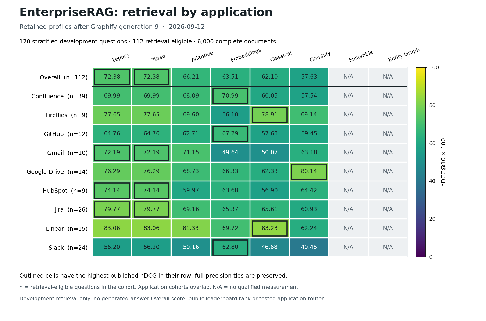

# EnterpriseRAG: application comparison after Graphify 9

Date: 2026-09-12. This figure displays the retained profiles from the published
[Graphify generation 9 comparison](../graphify-generation-009-001/comparison.md).
It adds a visual view of existing measurements; it creates no new evaluation,
candidate selection or promotion.



[Download PNG](applications.png) · [Download SVG](applications.svg) ·
[Full-precision matrix and artifact hashes](matrix.json)

## Reading the figure

Each number is frozen-category-weighted nDCG@10 multiplied by 100. The color
scale stays fixed from 0 to 100. Outlined cells have the highest published value
within that row, including ties at the comparison's full-precision tolerance.
These outlines describe the supplied observations; they do not select a router
or establish statistical significance.

The workload contains 120 stratified development questions, 112
retrieval-eligible questions and 6,000 complete documents. Row labels show the
number of retrieval-eligible questions in each cohort. Application cohorts
overlap and must not be added together. The overall eligible population weight
is 470. This snapshot is neither the all-500 result nor generated-answer Overall
or a public leaderboard position.

All eight strategies remain visible. Ensemble and Entity Graph are marked
**N/A** because this comparison has no qualified native measurement for them.
Unavailable values are not zero scores. Legacy and Turso lead overall; Graphify
leads Google Drive. Full paired changes and the four regressions in the Graphify
gain remain available in the [source report](../graphify-generation-009-001/README.md)
and [paired groups](../graphify-generation-009-001/groups.md).

## Reproduce from public files

Use Python with Matplotlib available and run from the repository root. Choose
an unused output leaf; the renderer refuses to overwrite an existing report.
The following command reproduces this dated source into a different directory:

```powershell
python evaluations/render_enterprise_application_heatmap.py --comparison graphify-generation-009-001 --comparison-sha256 8ab31ef98aa505f6f9cf5758449495e7cc698106ad5d0ab6cae245ea3e54952e --inventory opportunity-accounting-002 --inventory-sha256 5707dc9de5ebcd141e9c8185e95de1b16cf22fa8cf0cc81b6cdfe47fff3473f6 --output application-heatmap-002
```

The [renderer](../../../../render_enterprise_application_heatmap.py) validates
the explicitly supplied public comparison and dated inventory before creating
output. The inventory checks the existing presentation contract; its historical
counts are not displayed as current reservations. It reads no corpus, question
text, native trace or sealed validation data. The matrix records both input
digests, renderer and validation-helper digests, Matplotlib version, full
numeric values, missing cells, row leaders and image hashes. Plot cache files
stay under the repository's ignored `tmp/` directory. Partial outputs are retained
if rendering fails; use a new output leaf after diagnosing a failure.

This figure remains attached to its original Graphify 9 observation when later
results arrive. A later comparison requires its own exact source digest and
new output directory. See [ADR 0161](../../../../../.specs/adr/0161-bind-enterprise-application-heatmaps.md).

The figure was visually inspected, and 41 focused plotting/current-view tests
passed. Application gate 061 passed **1,697 tests and 373 subtests with 90.5%
total application coverage**. The publication audit verifies all 80 cells,
including 20 unavailable cells, against the exact published source and checks
image hashes, source bindings, current-view preservation and local links.

[General comparison](../graphify-generation-009-001/comparison.md) ·
[Cost, time and quality](../graphify-generation-009-001/cta.md) ·
[Report hub](../../../README.md)
