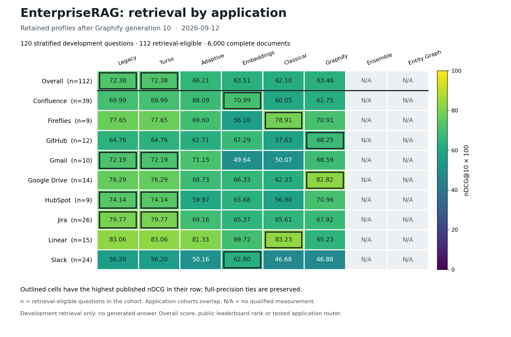

# EnterpriseRAG: application comparison after Graphify 10

Date: 2026-09-12. This figure presents the exact
[Graphify generation 10 comparison](../graphify-generation-010-001/comparison.md).
It adds no evaluation, candidate selection or promotion.



[PNG](applications.png) · [SVG](applications.svg) · [Full-precision matrix and hashes](matrix.json)

Values are frozen-category-weighted nDCG@10 multiplied by 100 on a fixed 0–100
color scale. Outlines mark the highest published value per row, preserving
full-precision ties. All eight strategy columns remain visible; **N/A** means
no qualified measurement and is not a zero score. The row counts show
retrieval-eligible questions. Application cohorts overlap.

The workload contains 120 stratified development questions, 112
retrieval-eligible questions, 6,000 complete documents and an overall eligible
population weight of 470. These are development retrieval metrics, not
generated-answer Overall, an all-500 result, a public leaderboard rank or a
tested application router. This dated figure remains attached to its original
source when later measurements arrive.

Graphify reaches **63.46** overall and leads **GitHub at 68.25** and **Google
Drive at 82.82**. Legacy and Turso retain the overall lead at **72.38**. The
[gain report](../graphify-generation-010-001/README.md) preserves all paired
outcomes: 46 improvements, four regressions, 62 ties and eight questions without
retrieval references. See [CTA](../graphify-generation-010-001/cta.md) for cost
and timing alongside these quality measurements.

To reproduce from public files, use Python with Matplotlib and an unused output
leaf from the repository root:

```powershell
python evaluations/render_enterprise_application_heatmap.py --comparison graphify-generation-010-001 --comparison-sha256 03b813a5c7f64eb1efeb88aa2d245070be3413ab7cc94df7f2cfed13ce1589b8 --inventory opportunity-accounting-002 --inventory-sha256 5707dc9de5ebcd141e9c8185e95de1b16cf22fa8cf0cc81b6cdfe47fff3473f6 --output application-heatmap-002
```

The [renderer](../../../../render_enterprise_application_heatmap.py) and
[procedure](../../../../../docs/evaluation-datasets-and-reports.md#render-a-public-application-comparison)
explain the explicit input digests, public-only validation, local cache and
append-only output. The matrix binds the original aggregates, implementation,
Matplotlib version and image hashes. No raw corpus, task text, native trace or
sealed validation data is read. Existing output is rejected and partial failed
output is preserved. The [previous visual snapshot](../application-heatmap-001/README.md)
remains unchanged.

The PNG was visually inspected and all 80 matrix cells were checked against
the new public comparison. Application gate 061 passed **1,697 tests and 373
subtests with 90.5% total application coverage**; the renderer is unchanged from
that verified implementation.
