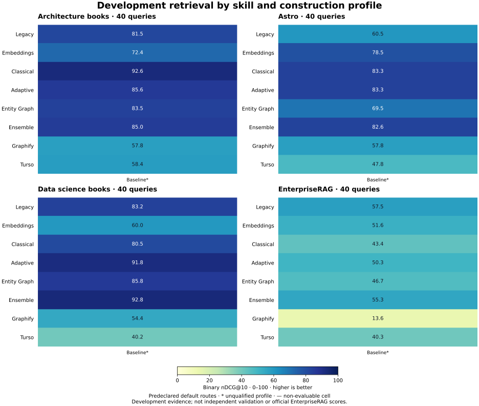

# Completed native baseline diagnostics

[Campaign and controller rejection](../README.md) · [CTA](cta.md) · [Exact aggregate provenance](aggregates.json)

**Diagnostic only: excluded from evolution ranking and promotion.** All 32 native trials completed without execution errors and passed evidence integrity. The owning Pareto controller rejected configured agent name `null` versus observed `skill-retrieval` before evaluating a candidate or emitting an archive. The qualification flags in these views therefore remain false despite complete native measurements.

The standalone native reporter records **66.49% mean default-route nDCG@10** over 32 equally weighted dataset-by-family cells. Each cell contains 40 queries. There are 72 route aggregates and 2,880 executed query-route combinations. Thirteen cells reach the descriptive 0.8 quality cutoff; nineteen do not. Neither count changes the separate 32/32 evidence-integrity result.

[PNG figure](comparison.png) · [SVG figure](comparison.svg)

## Strongest measured baseline route per dataset

This table compares routes within the completed diagnostic baseline only. It does not identify an evolved or accepted candidate.

| Dataset | Best baseline family / route | nDCG@10 |
|---|---|---:|
| architecture | classical / fusion | 92.58 |
| astro | embeddings / lexical | 85.95 |
| data-science | ensemble / fast | 94.44 |
| enterprise | entity-graph / lexical | 59.40 |

## Browse measured routes

Skills: [adaptive](by-skill/adaptive.md) · [classical](by-skill/classical.md) · [embeddings](by-skill/embeddings.md) · [ensemble](by-skill/ensemble.md) · [entity-graph](by-skill/entity-graph.md) · [graphify](by-skill/graphify.md) · [legacy](by-skill/legacy.md) · [turso](by-skill/turso.md)

Datasets: [architecture](by-dataset/architecture.md) · [astro](by-dataset/astro.md) · [data-science](by-dataset/data-science.md) · [enterprise](by-dataset/enterprise.md)

Profile: [baseline](by-profile/baseline.md)

All metrics originate in the completed native report or verifier aggregates; no queries were rescored for publication. Raw questions, gold references, task identities, logs, candidate copies and native jobs remain ignored. The private validation gate was never released. The original native artifacts and controller refusal are preserved.

These are reduced-corpus retrieval diagnostics, not official EnterpriseRAG answer quality or full-benchmark results. The common Graphify correctness repair predates this baseline and cannot be presented as a profile effect.
