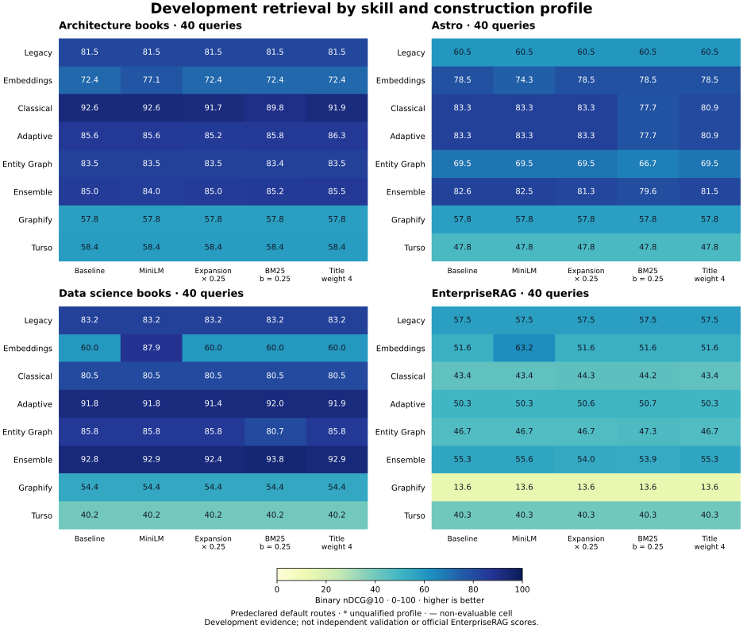

# Construction-profile development, generation 0

[Evolution studies](../../README.md)

Scores are binary nDCG@10 on a 0–100 display scale. The primary score weights each of the 32 dataset × family cells equally. All retrieval routes and resource measurements are available in [routes.csv](routes.csv); exact native provenance is in [aggregates.json](aggregates.json).

These are development diagnostics. Archive membership does not establish validation or promotion. Every registered task remains in the completion/error counts. An unqualified profile has no comparable primary score; any partial native diagnostic mean is retained separately in the machine-readable evidence.

| Profile | Qualified | Completed / expected cells | Errors | Primary nDCG@10 | Gain, pp | Improved / unchanged / regressed cells |
|---|---|---:|---:|---:|---:|---|
| neural-record | True | 32 / 32 | 0 | 67.72 | 1.22 | 5 / 24 / 3 |
| baseline | True | 32 / 32 | 0 | 66.49 | 0.00 | 0 / 32 / 0 |
| quarter-expansion | True | 32 / 32 | 0 | 66.38 | -0.12 | 2 / 21 / 9 |
| stronger-titles | True | 32 / 32 | 0 | 66.33 | -0.17 | 4 / 24 / 4 |
| bm25-low-b | True | 32 / 32 | 0 | 65.77 | -0.72 | 7 / 17 / 8 |

Gain is the candidate-minus-baseline difference in percentage points. Cell counts use unrounded default-route values and do not imply independent samples. [Every default-route change by dataset and skill](changes.md) is retained, including unavailable comparisons.

[Download PNG](comparison.png) · [Download SVG](comparison.svg)

## Reports by skill, profile and dataset

Skill families: [adaptive](by-skill/adaptive.md) · [classical](by-skill/classical.md) · [embeddings](by-skill/embeddings.md) · [ensemble](by-skill/ensemble.md) · [entity-graph](by-skill/entity-graph.md) · [graphify](by-skill/graphify.md) · [legacy](by-skill/legacy.md) · [turso](by-skill/turso.md).

Profiles: [baseline](by-profile/baseline.md) · [bm25-low-b](by-profile/bm25-low-b.md) · [neural-record](by-profile/neural-record.md) · [quarter-expansion](by-profile/quarter-expansion.md) · [stronger-titles](by-profile/stronger-titles.md).

Datasets: [architecture](by-dataset/architecture.md) · [astro](by-dataset/astro.md) · [data-science](by-dataset/data-science.md) · [enterprise](by-dataset/enterprise.md).

## Which skill is strongest on each dataset?

Best measured default routes among qualified profiles. This is an exploratory view of development evidence, not a routed policy or a replacement for the frozen selection rule.

| Dataset | Skill family / profile | nDCG@10 |
|---|---|---:|
| architecture | classical / baseline, classical / neural-record | 92.58 |
| astro | adaptive / baseline, adaptive / neural-record, classical / baseline, classical / neural-record | 83.34 |
| data-science | ensemble / bm25-low-b | 93.79 |
| enterprise | embeddings / neural-record | 63.19 |

## Best measured strategy across all 18 routes

These maxima include secondary routes from qualified profiles. They describe which measured strategy retrieves best on each development dataset; they do not change the frozen default-route selection rule or establish a validated routing policy.

| Dataset | Skill family / route / profile | nDCG@10 |
|---|---|---:|
| architecture | classical / fusion / baseline, classical / fusion / neural-record | 92.58 |
| astro | embeddings / lexical / baseline, embeddings / lexical / bm25-low-b, embeddings / lexical / neural-record, embeddings / lexical / quarter-expansion, embeddings / lexical / stronger-titles | 85.95 |
| data-science | ensemble / fast / baseline, ensemble / fast / neural-record | 94.44 |
| enterprise | embeddings / hybrid / neural-record | 63.19 |

## Best observed default route by dataset and family

These local maxima may come from different profiles, including unqualified profiles with failures elsewhere. They are diagnostics, not promotion or a new selection rule; see each profile's qualification above.

| Dataset | Family | Profile(s) | nDCG@10 |
|---|---|---|---:|
| architecture | adaptive | stronger-titles | 86.29 |
| architecture | classical | baseline, neural-record | 92.58 |
| architecture | embeddings | neural-record | 77.08 |
| architecture | ensemble | stronger-titles | 85.55 |
| architecture | entity-graph | baseline, neural-record, quarter-expansion, stronger-titles | 83.50 |
| architecture | graphify | baseline, neural-record, quarter-expansion, bm25-low-b, stronger-titles | 57.76 |
| architecture | legacy | baseline, neural-record, quarter-expansion, bm25-low-b, stronger-titles | 81.55 |
| architecture | turso | baseline, neural-record, quarter-expansion, bm25-low-b, stronger-titles | 58.40 |
| astro | adaptive | baseline, neural-record | 83.34 |
| astro | classical | baseline, neural-record | 83.34 |
| astro | embeddings | baseline, quarter-expansion, bm25-low-b, stronger-titles | 78.52 |
| astro | ensemble | baseline | 82.62 |
| astro | entity-graph | baseline, neural-record, quarter-expansion, stronger-titles | 69.47 |
| astro | graphify | baseline, neural-record, quarter-expansion, bm25-low-b, stronger-titles | 57.79 |
| astro | legacy | baseline, neural-record, quarter-expansion, bm25-low-b, stronger-titles | 60.52 |
| astro | turso | baseline, neural-record, quarter-expansion, bm25-low-b, stronger-titles | 47.81 |
| data-science | adaptive | bm25-low-b | 91.97 |
| data-science | classical | baseline, neural-record, quarter-expansion, bm25-low-b, stronger-titles | 80.54 |
| data-science | embeddings | neural-record | 87.89 |
| data-science | ensemble | bm25-low-b | 93.79 |
| data-science | entity-graph | baseline, neural-record, quarter-expansion, stronger-titles | 85.79 |
| data-science | graphify | baseline, neural-record, quarter-expansion, bm25-low-b, stronger-titles | 54.41 |
| data-science | legacy | baseline, neural-record, quarter-expansion, bm25-low-b, stronger-titles | 83.22 |
| data-science | turso | baseline, neural-record, quarter-expansion, bm25-low-b, stronger-titles | 40.16 |
| enterprise | adaptive | bm25-low-b | 50.69 |
| enterprise | classical | quarter-expansion | 44.35 |
| enterprise | embeddings | neural-record | 63.19 |
| enterprise | ensemble | neural-record | 55.61 |
| enterprise | entity-graph | bm25-low-b | 47.28 |
| enterprise | graphify | baseline, neural-record, quarter-expansion, bm25-low-b, stronger-titles | 13.63 |
| enterprise | legacy | baseline, neural-record, quarter-expansion, bm25-low-b, stronger-titles | 57.50 |
| enterprise | turso | baseline, neural-record, quarter-expansion, bm25-low-b, stronger-titles | 40.32 |

## Cost, time and accuracy

[CTA table](cta.md) · [CTA data by dataset, family and profile](cta.csv).

The experiment makes no instruction-model calls and incurs no model-provider charge. Local CPU/model execution still has a real resource cost. `double_build_seconds` includes two independent validated builds; storage counts one knowledge artifact. Query P95 covers the complete fixed cohort on each route. Timings are descriptive under two concurrent CPU-limited trials, not production latency guarantees.

Historical datasets are exposed development evidence. The independent validation portfolio remains outside this report. Do not compare these retrieval scores directly with the public EnterpriseRAG answer-quality leaderboard.
