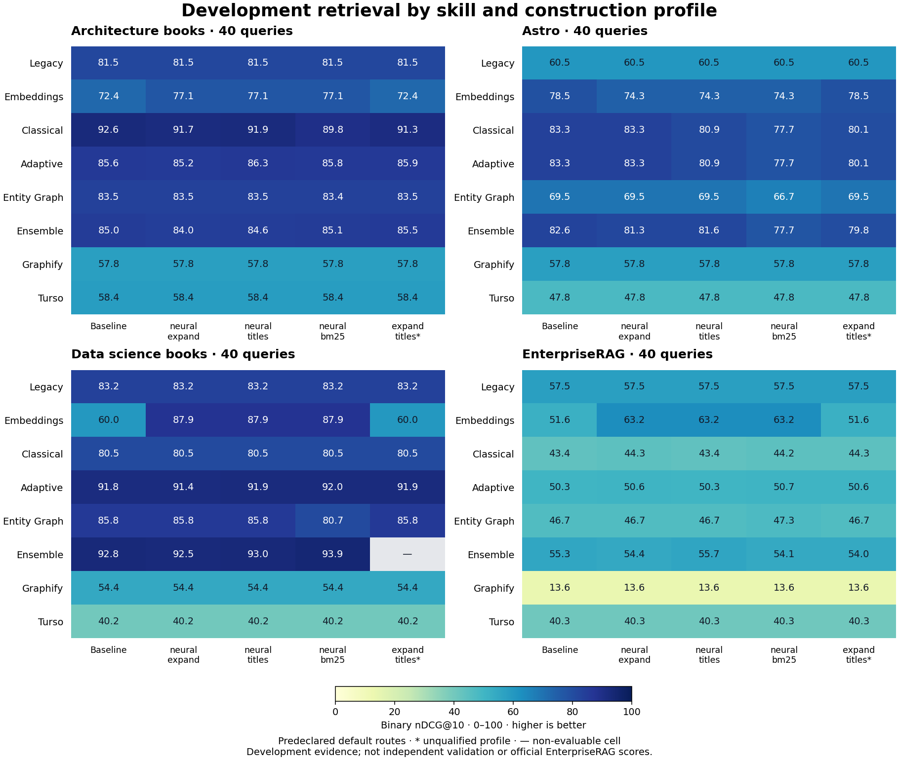

# Development comparison after an interrupted generation

[Study overview](../README.md) · [Aggregate provenance](aggregates.json) · [CTA](cta.md)

**319 / 320 native trials have results; 1 is unavailable.** The controller and its last container stopped before generation one produced a native archive. Recorded native errors cover completed results only; zero recorded errors does not mean a complete campaign.

This report preserves both generations, all ten measured runs of nine profiles, and the missing cell. It creates no archive or selection and opens no private gate. Generation zero retains its original archive; generation one has none. Qualified in these tables means all 32 cells are complete, error-free and meet the integrity gate. It does not imply archive membership or validation.

Binary nDCG@10 uses a 0-100 display scale. Complete profile means equally weight the 32 default-route cells. Differences use each generation's own baseline. Repeated baselines retain separate identities and are not independent samples.

| Run | Complete / expected | Recorded errors | Qualified | nDCG@10 | Gain, pp | Improved / tied / regressed |
|---|---:|---:|---|---:|---:|---|
| [g0-neural-record](by-profile/g0-neural-record.md) | 32 / 32 | 0 | True | 67.72 | 1.22 | 5 / 24 / 3 |
| [g1-neural-expand](by-profile/g1-neural-expand.md) | 32 / 32 | 0 | True | 67.61 | 1.11 | 5 / 17 / 10 |
| [g1-neural-titles](by-profile/g1-neural-titles.md) | 32 / 32 | 0 | True | 67.56 | 1.07 | 7 / 19 / 6 |
| [g1-neural-bm25](by-profile/g1-neural-bm25.md) | 32 / 32 | 0 | True | 66.97 | 0.47 | 10 / 13 / 9 |
| [g0-baseline](by-profile/g0-baseline.md) | 32 / 32 | 0 | True | 66.49 | 0.00 | 0 / 32 / 0 |
| [g1-baseline](by-profile/g1-baseline.md) | 32 / 32 | 0 | True | 66.49 | 0.00 | 0 / 32 / 0 |
| [g0-quarter-expansion](by-profile/g0-quarter-expansion.md) | 32 / 32 | 0 | True | 66.38 | -0.12 | 2 / 21 / 9 |
| [g0-stronger-titles](by-profile/g0-stronger-titles.md) | 32 / 32 | 0 | True | 66.33 | -0.17 | 4 / 24 / 4 |
| [g0-bm25-low-b](by-profile/g0-bm25-low-b.md) | 32 / 32 | 0 | True | 65.77 | -0.72 | 7 / 17 / 8 |
| [g1-expand-titles](by-profile/g1-expand-titles.md) | 31 / 32 | 0 | False | unavailable | unavailable | unavailable / unavailable / unavailable |

## Best measured default skill on each dataset

Only complete qualified profiles enter these descriptive maxima. A route maximum is not a validated routing policy.

| Dataset | Skill / route | nDCG@10 | Run(s) |
|---|---|---:|---|
| [architecture](by-dataset/architecture.md) | classical / fusion | 92.58 | g0-baseline, g0-neural-record, g1-baseline |
| [astro](by-dataset/astro.md) | adaptive / adaptive | 83.34 | g0-baseline, g0-neural-record, g1-baseline |
| [astro](by-dataset/astro.md) | classical / fusion | 83.34 | g0-baseline, g0-neural-record, g1-baseline |
| [data-science](by-dataset/data-science.md) | ensemble / quality | 93.90 | g1-neural-bm25 |
| [enterprise](by-dataset/enterprise.md) | embeddings / hybrid | 63.19 | g0-neural-record, g1-neural-bm25, g1-neural-expand, g1-neural-titles |

## Best measured strategy across all 18 routes

Only complete qualified profiles enter these descriptive maxima. A route maximum is not a validated routing policy.

| Dataset | Skill / route | nDCG@10 | Run(s) |
|---|---|---:|---|
| [architecture](by-dataset/architecture.md) | classical / fusion | 92.58 | g0-baseline, g0-neural-record, g1-baseline |
| [astro](by-dataset/astro.md) | embeddings / lexical | 85.95 | g0-baseline, g0-bm25-low-b, g0-neural-record, g0-quarter-expansion, g0-stronger-titles, g1-baseline, g1-neural-bm25, g1-neural-expand, g1-neural-titles |
| [data-science](by-dataset/data-science.md) | ensemble / fast | 94.44 | g0-baseline, g0-neural-record, g1-baseline |
| [enterprise](by-dataset/enterprise.md) | embeddings / hybrid | 63.19 | g0-neural-record, g1-neural-bm25, g1-neural-expand, g1-neural-titles |

## Browse every measurement

by-skill: [adaptive](by-skill/adaptive.md) · [classical](by-skill/classical.md) · [embeddings](by-skill/embeddings.md) · [ensemble](by-skill/ensemble.md) · [entity-graph](by-skill/entity-graph.md) · [graphify](by-skill/graphify.md) · [legacy](by-skill/legacy.md) · [turso](by-skill/turso.md)

by-profile: [g0-baseline](by-profile/g0-baseline.md) · [g0-bm25-low-b](by-profile/g0-bm25-low-b.md) · [g0-neural-record](by-profile/g0-neural-record.md) · [g0-quarter-expansion](by-profile/g0-quarter-expansion.md) · [g0-stronger-titles](by-profile/g0-stronger-titles.md) · [g1-baseline](by-profile/g1-baseline.md) · [g1-expand-titles](by-profile/g1-expand-titles.md) · [g1-neural-bm25](by-profile/g1-neural-bm25.md) · [g1-neural-expand](by-profile/g1-neural-expand.md) · [g1-neural-titles](by-profile/g1-neural-titles.md)

by-dataset: [architecture](by-dataset/architecture.md) · [astro](by-dataset/astro.md) · [data-science](by-dataset/data-science.md) · [enterprise](by-dataset/enterprise.md)

## Unavailable evidence

[All failed or missing cells](failures.csv). The interrupted Data-science / Ensemble cell has no native TrialResult, reward, final duration or verified build artifact. Its missing measurement is not set to zero or replaced with another profile. The partial profile's measured rows remain diagnostic, with no comparable mean, gain or win.

[Generation-zero comparison and chart](../generation-000/README.md) · [Every paired default cell](primary_changes.csv)

These are reduced internal retrieval diagnostics, not official EnterpriseRAG answer-quality scores or full BEIR results. The independent validation portfolio remains sealed. No canonical profile is promoted by this report.
