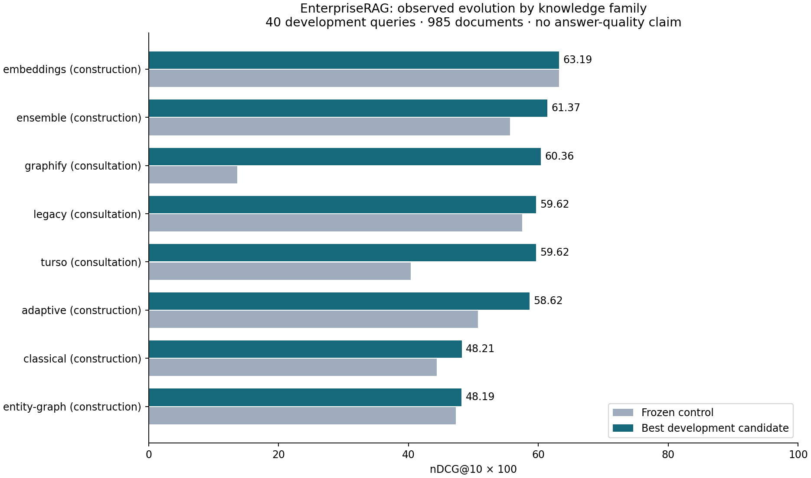

# EnterpriseRAG evolution across eight knowledge families

[Report hub](../../README.md) · [Evolution studies](../README.md) · [Execution guide](../../../../docs/enterprise-evolution-sweep.md)

**Scope correction, 2026-09-07:** the historical manifest omitted document-body
mapping. All 114 native trials are digest-bound to a title-only knowledge
projection. The scores below retain their original values and must be interpreted
within that scope. See the [ingestion audit](../../enterprise-source-skills/ingestion-scope-20260907.md).

Completed on **2026-09-07**: 106 new candidates and eight fresh controls across
eight knowledge families. All 114 native trials completed and qualified, with
265 route measurements and no recorded execution errors. Seven families improved
over their controls. The highest primary-route score remains the unchanged
**Embeddings hybrid control, at 63.19 nDCG@10**.

The [terminal decision](terminal-001/README.md) retains that control. The reserved
independent validation portfolio was not opened, and no candidate was promoted
or installed as a canonical default by this campaign.

[Native development report](development-001/README.md) ·
[Primary comparison](catalog-001/comparison.md) ·
[Exact retained profiles](catalog-001/profiles.md) ·
[All 18 retained-profile routes](catalog-001/routes.md) ·
[CTA](development-001/CTA.md) ·
[Stopping ledger](development-001/strategies.md)

## Observed improvement by family

| Family | Control nDCG@10 | Retained nDCG@10 | Gain pp | New candidates |
|---|---:|---:|---:|---:|
| [Embeddings](development-001/by-skill/embeddings.md) | 63.19 | 63.19 | 0.00 | 6 |
| [Ensemble](development-001/by-skill/ensemble.md) | 55.66 | 61.37 | 5.70 | 18 |
| [Graphify](development-001/by-skill/graphify.md) | 13.63 | 60.36 | 46.73 | 13 |
| [Legacy](development-001/by-skill/legacy.md) | 57.50 | 59.62 | 2.12 | 10 |
| [Turso](development-001/by-skill/turso.md) | 40.32 | 59.62 | 19.30 | 10 |
| [Adaptive](development-001/by-skill/adaptive.md) | 50.69 | 58.62 | 7.93 | 18 |
| [Classical](development-001/by-skill/classical.md) | 44.35 | 48.21 | 3.86 | 16 |
| [Entity Graph](development-001/by-skill/entity-graph.md) | 47.28 | 48.19 | 0.91 | 15 |

Scores are scaled by 100; gains use unrounded source values. Every control
reproduced its strongest completely measured historical Enterprise score before
new children executed. Secondary routes did not change candidate selection.

## What the retained profiles changed

- Graphify retained depth 4 and lexical fusion weight 4.0. Its rank-decay
  variants explicitly used lexical weight 1.0; those compound mutations did
  not test decay while holding the winning weight at 4.0.
- Legacy and Turso retained BM25 with `k1=2.0`. Turso hydrates records from SQL
  and ranks them in memory; this is a consultation treatment.
- Adaptive and Classical retained relevance weight 1.0, zero source/topic
  novelty weights, length normalization `b=1.0`, and title weight 1.0.
- Entity Graph retained one hop, zero candidate-edge weight, and `b=0.0`.
- Ensemble retained quality weights `[1, 1, 1, 8]` together with its improved
  Adaptive component. Embeddings retained the pinned MiniLM control.

The [profile records](catalog-001/profiles.md) bind these overrides to exact
complete-bundle digests. They preserve experimental candidates for reproduction;
they do not establish performance on other workloads or installed defaults.

## Stopping and validation

Of 33 declared tactics, **16 stopped after three consecutive non-improvements**
and **17 exhausted their finite variant lists**. A gain reset the miss counter.
Four duplicate profiles were omitted without execution or failure credit; six
variants were left unused after three-miss stops. The 116-variant budget is
fully accounted for as 106 evaluated, four duplicates and six unused variants.
The last Ensemble allocation still improved; its stop reason is finite
exhaustion, not a three-miss plateau. Further mutation hypotheses require a new
declared study.

Legacy, Turso and Graphify are consultation treatments. The other five families
are construction treatments. All development trials use the same 40 exposed
questions on 985 documents, including 85 references and 900 fixed distractors.
They constitute one Enterprise source/annotation group. This is a reduced
document-retrieval contract; the [official answer-quality reference](../../../enterprise-rag-bench/reports/public-results-20260906.md)
uses a different metric and corpus.

The unchanged finalist left FiQA and SciFact reserved and unopened. No unseen
Enterprise performance or independent transfer improvement was established.
Development and catalog publications were reviewed and bound on the evolution
stage before selection. The terminal report transcribes the source-bound
decision; validation and publication stages were stopped under the declared
unchanged-finalist rule.

The [protocol decision](../../../../.specs/adr/0122-enterprise-three-miss-evolution-sweep.md)
defines one native owner, `harbor-reflective-pareto-search`, for this finite
mutation sweep. It does not compare the five evolution controller algorithms.
Raw datasets, questions, relevance labels, model weights, native jobs and
candidate copies remain in ignored local paths. The reviewed aggregate reports
and [cross-dataset catalog](../../README.md) remain in the repository.
